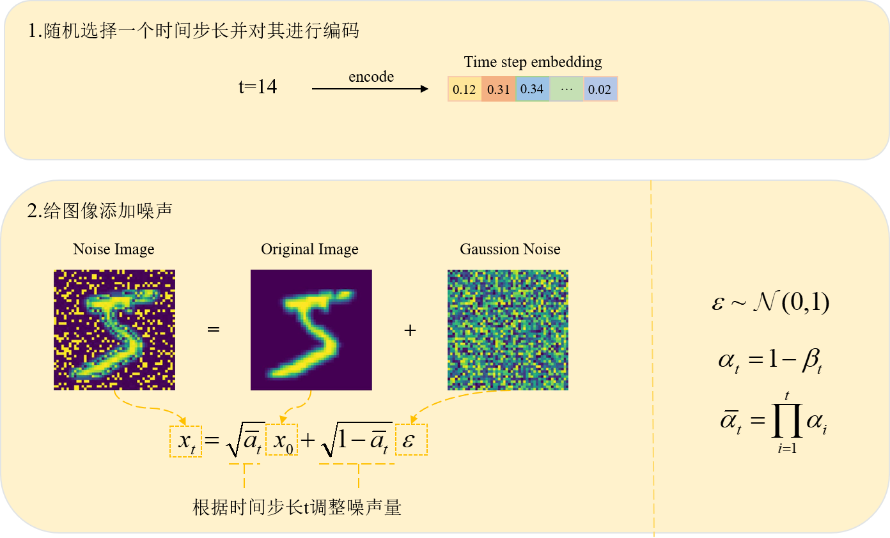
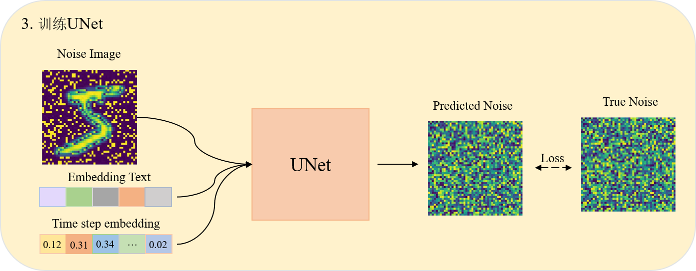
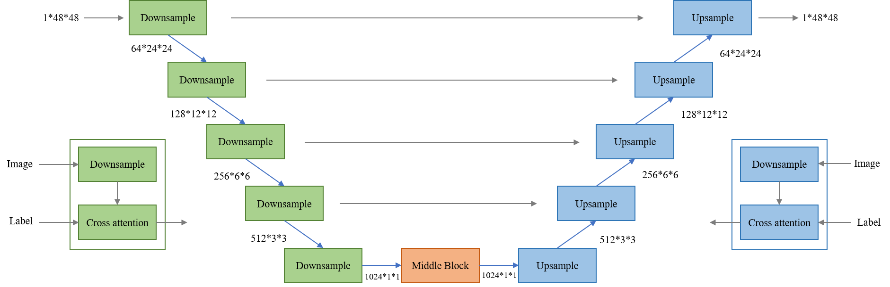
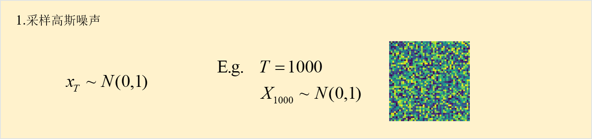
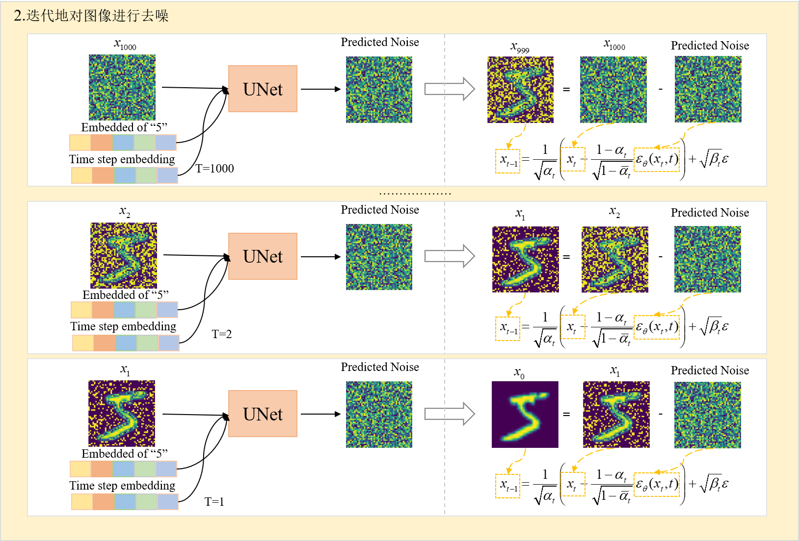
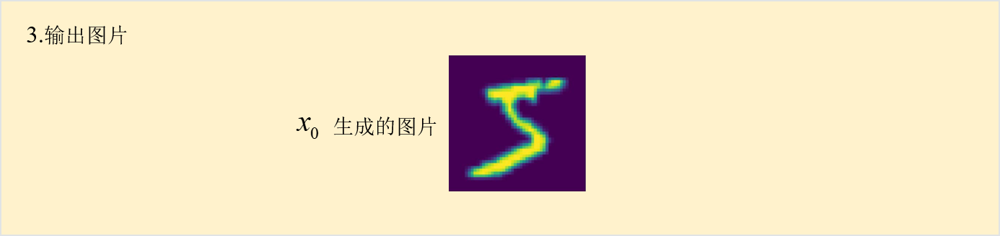
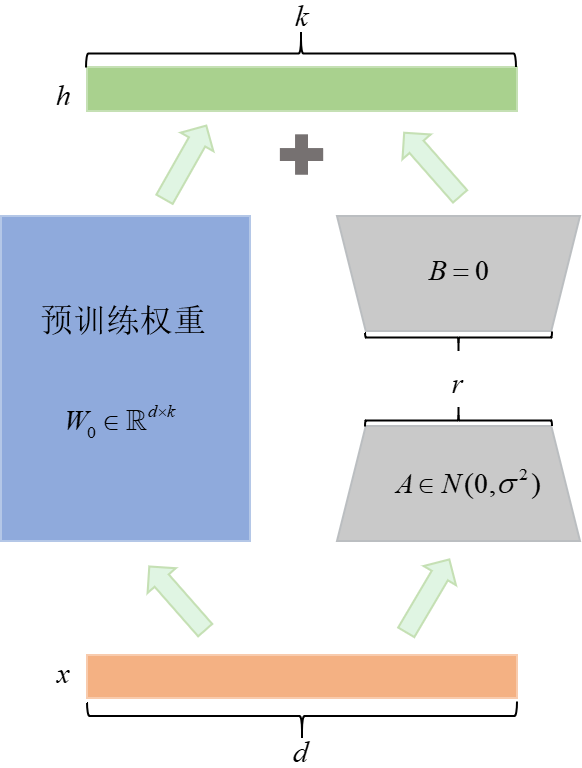
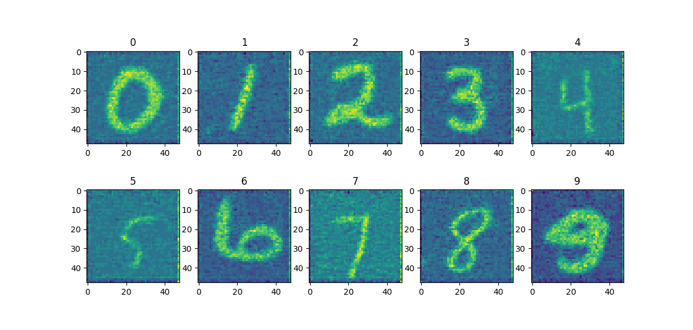
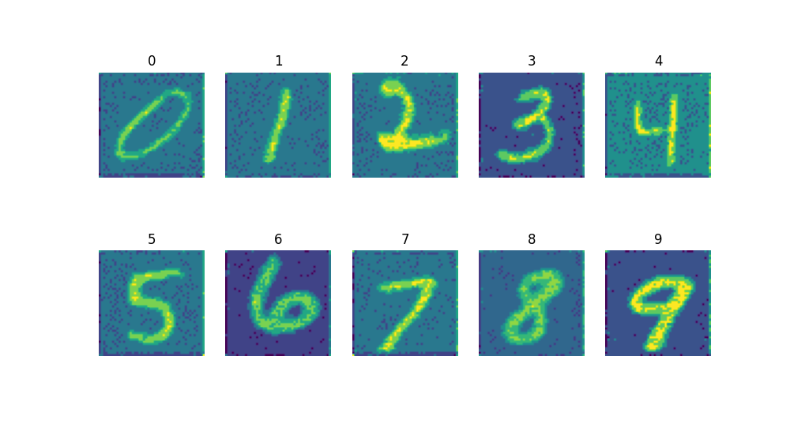

# Stable Diffusion + LoRA微调

- [Stable Diffusion + LoRA微调](#stable-diffusion--lora微调)
  - [1.Stable Diffusion原理](#1stable-diffusion原理)
    - [1.1前向加噪](#11前向加噪)
    - [1.2训练UNet](#12训练unet)
    - [1.3 反向去噪](#13-反向去噪)
  - [2.LoRA微调](#2lora微调)
  - [3. 实现](#3-实现)
    - [3.1模型训练](#31模型训练)
    - [3.2 模型效果](#32-模型效果)
  - [Reference](#reference)


## 1.Stable Diffusion原理

`Stable Diffusion`是在[DiffusionModel](https://github.com/JiaxingSong718/DifussionModel)基础上将标签作为引导词融入到图像中，最终可以根据引导词的输入生成对应的图片，即根据用户的描述生成相应的图片。

具体的修改只改动了UNet结构，通过`cross attention`将文本信息融入到图像中。(**像素做Query, 计算对分类ID的注意力，实现分类信息融入图像，不改变图像形状和通道数**)

### 1.1前向加噪



### 1.2训练UNet



UNet结构



### 1.3 反向去噪

相对于[DiffusionModel](https://github.com/JiaxingSong718/DifussionModel)多了一个引导词，可以生成与描述相一致的图片







在引导词“5”的作用下生成手写数字“5”。

## 2.LoRA微调

LoRA 允许我们通过优化适应过程中密集层变化的秩分解矩阵，来间接训练神经网络中的一些密集层，同时保持预先训练的权重不变，原理图如下。



LoRA 的思想很简单:

- 在原始 `PLM (Pre-trained Language Model)` 旁边增加一个旁路，做一个降维再升维的操作，来模拟所谓的`intrinsic rank`。
- 训练的时候固定 PLM 的参数，只训练降维矩阵 $$A$$ 与升维矩阵 $$B$$ 。而模型的输入输出维度不变，输出时将 $$BA$$ 与 `PLM `的参数叠加。
- 用随机高斯分布初始化 $$A$$ ，用 0 矩阵初始化  $$B$$ ，保证训练的开始此旁路矩阵依然是 `0` 矩阵。

假设要在下游任务微调一个预训练语言模型（如 GPT-3），则需要更新预训练模型参数，公式表示如下：
$$
W_0+ΔW
$$
$$W_0$$ 是预训练模型初始化的参数，$$ ΔW$$ 就是需要更新的参数。如果是全参数微调，则它的参数量 $$=W0$$ （如果是 GPT-3，则 $$ΔW≈175B$$ ）。从这可以看出要全参数微调大语言模型，代价是非常高的。

而对于 LORA 来说，只需要微调$$ ΔW$$ 。

具体来看，假设预训练的矩阵为 $$W_0∈R^{d×k}$$ ，它的更新可表示为：
$$
W_0+ΔW=W_0+BA,B∈R^{d×r},A∈R^{r×k}
$$
其中秩$$ r≪min(d,k) $$。

在 LoRA 的训练过程中， $$W_0$$ 是固定不变的，只有 $$A$$ 和$$ B$$ 是训练参数。

在前向过程中， $$W_0$$ 与 $$ΔW$$ 都会乘以相同的输入$$ x$$ ，最后相加：
$$
h=W_0x+ΔWx=W_0x+BAx
$$
LORA 的这种思想有点类似于残差连接，同时使用这个旁路的更新来模拟 Full Fine-Tuning的过程。并且，Full Fine-Tuning可以被看做是 LoRA 的特例（当$$ r$$ 等于 $$k$$ 时）。

在推理过程中，LoRA 也几乎未引入额外的 Inference Latency，只需要计算 $$W=W_0+ΔW$$ 即可。

LoRA源码：

```
class LoraLayer(nn.Module):
    def __init__(self,raw_linear,in_features,out_features,r,alpha) -> None:
        super().__init__()
        self.r = r
        self.alpha = alpha
        self.lora_a = nn.Parameter(torch.empty((in_features,r)))
        self.lora_b = nn.Parameter(torch.zeros((r, out_features)))

        nn.init.kaiming_uniform_(self.lora_a,a=math.sqrt(5))

        self.raw_linear = raw_linear

    def forward(self,x):
        raw_output = self.raw_linear(x)
        lora_output = x @ ((self.lora_a @ self.lora_b) * self.alpha / self.r)
        return raw_output + lora_output
```

**为什么初始化时需要 $$B$$ 初始化为零矩阵?**

通过将$$ B $$初始化为零矩阵，$$ΔW=A*B$$ 一开始为零矩阵，这样确保了在微调开始时:
$$
W_{new}=W+ΔW=W+0=W
$$
即，初始时微调模型的权重与预训练模型的权重保持一致。这确保了模型不会一开始就因为过大的权重变化而导致性能波动。

**随机初始化$$A$$的原因**

尽管 $$B$$ 初始化为零，但 $$A$$ 使用随机高斯分布进行初始化。这是为了确保在训练过程中，当 $$B$$ 不再为零矩阵时，$$A$$ 能够提供多样的参数更新方向。

+ **增加表示能力**：随机初始化 A 可以确保它具有丰富的表示能力，使得低秩矩阵 $$A*B$$ 能够探索广泛的权重调整空间。随机初始化提供了不同的起始点，从而能够在训练过程中捕捉更多的特征。
+ **避免对称性问题**：如果 A 初始为零或相同的值，可能会限制模型在调整过程中学习到多样化的特征。随机初始化打破了这种对称性，使得矩阵 A能够在训练过程中学到更复杂的特征组合。
+ **提供有效的梯度信息**：随机初始化 A可以防止梯度更新过程中出现梯度消失的问题。初始化时提供的非零梯度信息可以加速收敛，帮助模型更快地找到适应任务的最优参数。

## 3. 实现

基于mnist手写数字数据集的stable diffusion模型复现

可以输入引导数字，生成对应数字的图片

### 3.1模型训练

单独训练Stable Diffusion ：

```
python train.py
```

训练LoRA：

```
python lora_finetune.py
```

### 3.2 模型效果

单独Stable Diffusion ：

```
python denoise.py
```

通过引导词0-9生成0-9的手写数字：



在Stable Diffusion的基础上，将cross attention里面的`w_q,w_k,w_v`这三个`Linear`层替换成 `LoraLayer`，继续使用MNIST数据集进行训练，可以看到上图在单独使用Stable Diffusion时得到的图片模糊有较多的噪点，经过LoRA微调训练10轮后得到下图，数字清晰并且噪点减少，如果LoRA微调训练多几轮，会得到更加清晰的图片。

推理时使用LoRA：

```
# LORA
USE_LORA = False #将这里的参数改为True即可使用LoRA推断
if USE_LORA == True:
    pass
```

加上LoRA后：



## Reference

[LORA：大模型轻量级微调 - 知乎](https://zhuanlan.zhihu.com/p/623543497)

[pytorch-diffusion](https://github.com/owenliang/pytorch-diffusion)
